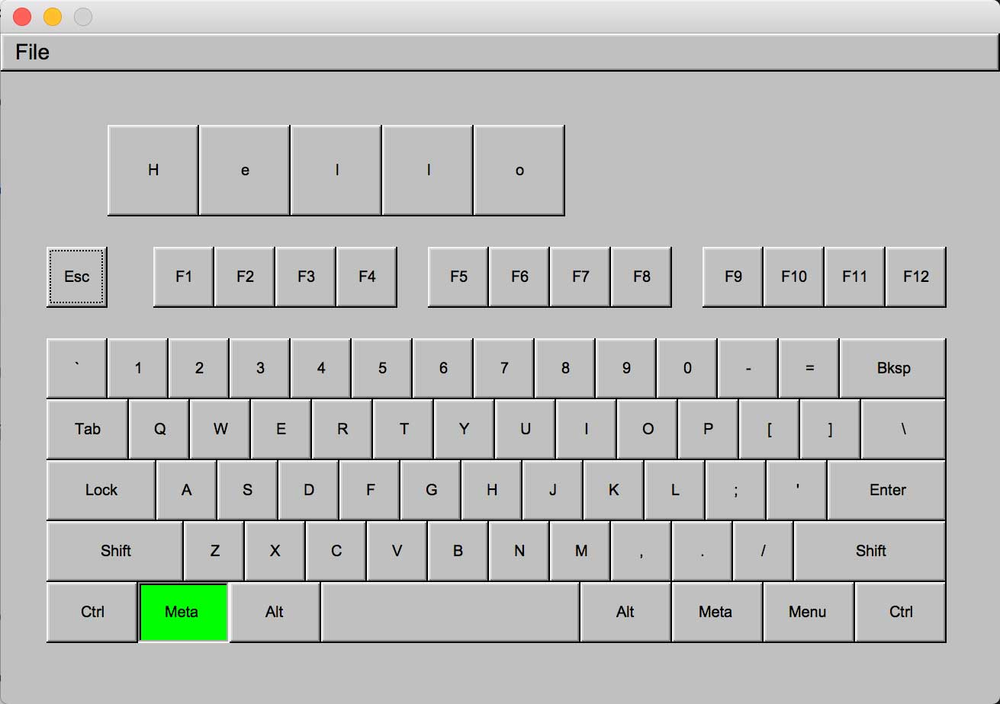

# Key symulator

### For compile this programm you need to have installed g++ and CMake

You need to have installed `git, g++, cmake, make, autoconf automake libtool`

if you are Mac OS user you can use `brew install cmake, make, autoconf automake libtool`

### Build project
- cd <keyplay root direcotry>
- mkdir build && cd build && cmake .. && make && ./keyplay

### TO DO:
- implement text board

